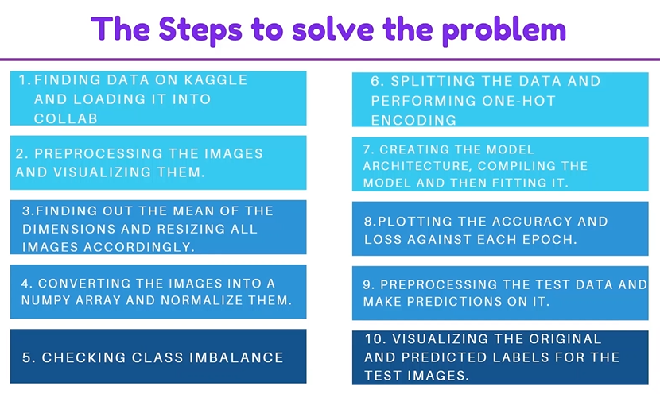

In this project, we have used Convolutional Neural Network to build train and test a traffic sign classification model. We've built this model using tensorflow and keras. It is a multiclass classification problem. This model can be used to make smarter cars.

The model which is built in this project can be used in self driving cars which will enable them to automatically recognize traffic signs similarly the driver alert system inside cars will help and protect drivers by understanding the traffic signs around them.

# Steps Followed

